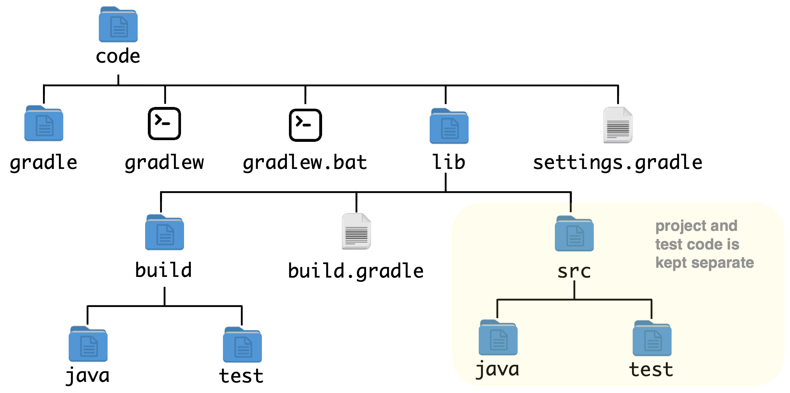

# COM3529 Practical Session 1: Getting Started

## GitHub Repository

The materials for this module will be pushed to a GitHub repository: 

[https://github.com/UoS-COM3529/com3529-2026](https://github.com/UoS-COM3529/com3529-2026)

You will need to do a `pull` each week to obtain the latest content.

## Java

All the code examples are in Java, and the tests are in JUnit. To use the Java examples in the repository, you will need to have **Java 11 or higher** installed on your machine.

## Gradle

The Java code examples are in a **Gradle** library.
Once you have cloned the repository, you can compile and run tests at
the terminal from the `code` directory.

These commands should work on Mac/Linux/WSL.  (For the Windows Prompt , replace the initial `./` with `.\`)

- Compile the code:

`./gradlew build`

- Run all tests:

`./gradlew test`

- Run all tests in a specific class:

`./gradlew test --tests uk.ac.shef.com3529.TriangleTest`

- Run a specific test:

`./gradlew test --tests uk.ac.shef.com3529.TriangleTest.shouldClassifyEquilateral`

See the [Gradle website](https://gradle.org) and documentation for more information.

## Use of  Integrated Developer Environments (IDEs)

**Most modern IDEs support Gradle**, e.g. VSCode and IntelliJ IDEA (recommended).

Just create a new project in the code directory and it should find the Gradle configuration.

From here, code will compile automatically and you can run specific tests from within the IDE.

## Gradle Project Structure

In a typical Gradle project, source code and test code are kept in separate directories under the main source directory.

- Production code lives in `src/java/` 
- Test code, i.e., JUnit test classes, live in `src/test`. 
  
For instance:



## JUnit

Throughout this module, we’ll be using **JUnit 5** as testing framework. To learn more, please browse the [JUnit 5 User Guide](https://docs.junit.org/5.14.2/overview.html).

Note that JUnit 6 was released in September 2025. In this module we will stick to JUnit 5, but feel free to upgrade at your own responsibility (i.e., _limited teaching support_).

## Let's Test!

In your IDE's project explorer panel, navigate to `src/main/java` and locate file `Triangle.java`. This is the class we are going to test. Now is a good moment to read and understand its code.

We are going to write our JUnit tests in a JUnit test class called `TriangleTest`, which you will find under `src/test/java`.

## A JUnit Test Class and a Test

Open `TriangleTest` in a code editor. What can you see?

```java
package uk.ac.shef.com3529;

import org.junit.jupiter.api.Test;

import static org.junit.jupiter.api.Assertions.assertEquals;
import static org.junit.jupiter.api.Assertions.assertThrows;

public class TriangleTest {

    @Test
    public void shouldTestTriangleClass() {
        // Write your test code here
        // Arrange
        // ..
        // Act
        // ..
        // Assert
        // ..
    }

    @Test
    public void shouldTestSomethingElseInTriangleClass() {
        // Write your test code here
    }

    // Write more test methods here to test different scenarios
}
```
Within the JUnit test class, tests are annotated with the `@Test` annotation.
This is how the framework knows which methods
are test methods (i.e., Java methods that should be executed as tests) and which are
helper methods.

### The Anatomy of a JUnit Test

A JUnit test has a _test method name_, which should be descriptive of the purpose of the test.

The actual test code (i.e., the body of the test method) usually starts by making method call(s) to set up a test scenario and put the system in the state we want to test (often through _setter_ methods). This part is often called the **fixture** or the **arrange phase** of the test.

Next, the code should include the call(s) to the method(s) that are the primary focus of the test..

Finally, a test **must** contain assertion statements to check
the **actual result** matches the **expected** one. _Is there any situation where you would want a test without any assertions?_

## JUnit Assertions

Its assertions are arguably the most important part of any test.

The `assertEquals` method is a part of
JUnit and specifically checks that some
**expected value** is **equal** to the **actual one** returned from the unit being tested.

JUnit has a plethora of assertion types
for checking relationships between
actual and expected outputs.

These include `assertTrue(booleanVariable)`, `assertNull(reference)`,
assertions on arrays and more. See:
[https://docs.junit.org/5.14.2/writing-tests/assertions.html](https://docs.junit.org/5.14.2/writing-tests/assertions.html)

## Testing Exceptional Behaviour

JUnit provides `assertThrows` to check for exceptions being thrown by the code. For example, the following test is checking that the division arithmetic operator throws an exception of type `ArithmeticException.class` when the divisor is zero:

```java
@Test
public void shouldThrowException() {
    assertThrows(ArithmeticException.class, () -> {int b = 5 / 0;});
    Exception e = assertThrows(ArithmeticException.class, () -> {int b = 5 / 0;});
    assertEquals("/ by zero", e.getMessage());
}
```

Notice the following:

- The second argument of `assertThrows` is a _lambda expression_ (also referred to as an anonymous function), which can be any _executable_ block of code (adhering to the syntax `() -> { }`).
- [`assertThrows`](https://docs.junit.org/5.8.0-RC1/api/org.junit.jupiter.api/org/junit/jupiter/api/Assertions.html#assertThrows(java.lang.Class,org.junit.jupiter.api.function.Executable)) is _overloaded_, meaning multiple alternative implementations are available. For instance, you can also check the exception message as follows:

```java
@Test
public void shouldThrowException() {
    Exception e = assertThrows(ArithmeticException.class, () -> {int b = 5 / 0;});
    assertEquals("/ by zero", e.getMessage());
}
```

Although arguably such checks can make the test more _brittle_. _Why might this be the case?_

## Tasks for Today

1. Clone the COM3529 repository to your device.
2. Ensure you can get Gradle and/or IDEA working with the code project.
3. Locate the implementation of the `daysBetweenTwoDates` method discussed in lectures. Its class lives in the repository:
`code/lib/src/main/java/uk/ac/shef/com3529/Calendar.java`
4. Where should its test class live in the Gradle organisation of the Java project?
5. Create the class and write some JUnit tests – try using a variety of [assertions](https://docs.junit.org/5.14.2/writing-tests/assertions.html) in your tests.
6. When thinking of tests to write, reflect on which tests you think are needed and why, and don’t forget to test for corner cases, e.g., leap years. Ask yourself this question: _Have I tested enough?_